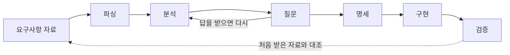
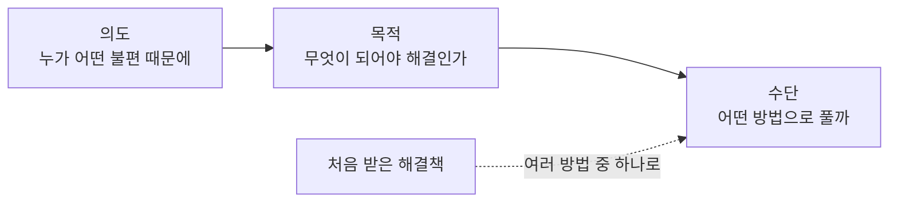
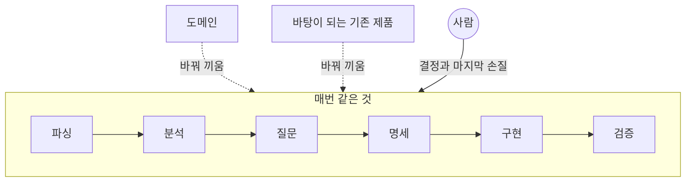

# 업무는 생각보다 정형화되어 있다(feat. Software Factory)

나는 다음과 같은 순서로 업무를 진행한다.

고객 혹은 기획자로부터 요구사항을 받는 것을 시작으로 문서를 읽고, 무엇을 원하는지 정리하고, 애매한 부분을 묻고, 명세를 만들고, 구현하고, 검증한다.

이 순서는 맡는 프로젝트가 달라지고, 도메인이 달라져도 거의 그대로다. 말하자면 프로젝트와 관계없이 정형화된 업무 패턴에 가까운 것 같다.

## 파싱

요구사항은 대부분 워드, 엑셀, PDF, PPT 같이 다양한 형태로 문서가 전달된다.

파싱할 때는 파싱한 문서의 결과가 원본 문서의 의도를 훼손한것은 없는지 주의 깊게 확인해야한다.

표가 한 칸씩 밀려 있거나 레이아웃이 깨져 있으면 최초 요구사항의 의도와 다르게 구현 방향이 잘못 설정될 수 있기 때문이다.

서식이나 배치로 의미를 전달하는 문서는 원본 페이지를 이미지로 남겨두고 파싱한 문서와 함께 읽을 수 있도록 만든다. PPT의 도형과 화살표나 양식 문서의 칸 배치처럼 위치가 곧 내용인 문서는, 텍스트만 뽑으면 원본의 의도와 맥락이 훼손될 수 있다. 그래서 자료를 파싱할때 원본을 남겨두고 둘다 확인 할 수 있도록 출처를 명시하고, 둘이 달라 보이는 부분을 원본을 보고 판단한다.

또한 엑셀은 값만 옮기지 않고 수식까지 함께 옮긴다. 실무자가 쓰던 엑셀에서 수식은 대개 그 업무의 계산 규칙에 가깝다. 
그래서 시트마다 수식이 걸려 있는지를 먼저 확인하고, 수식이 있으면 계산 결과와 함께 그 수식을 요구사항으로 참고한다.

## 분석

경험상 개발자에게 오는 요구사항은 대개 최초 요청이 아닌 이미 앞에서 여러번의 해석과 가공을 거친 뒤 해결책(how)의 형태로 오는 경우가 많았다. "여기에 버튼 하나 넣어주세요"라거나 "이 화면에서 엑셀로 내려받게 해주세요" 같은 식이다.

그래서 그대로 구현하게되면 처음에 문제를 제기한 실무자의 의도와 다르게, 요청받은걸 만들고도 진짜 문제는 해결되지 않은채로 남아있을 수도 있다.

요구사항을 분석할 때는 의도, 목적, 수단 순서로 본다. 의도(why)를 파악해야 방향(what)이 맞는지를 알 수 있고, 방향이 정해져야 수단(how)이 맞는지 생각해 볼 수 있다.

수단의 형태로 오면 일단 그 버튼이 왜 필요해졌는지, 누가 어떤 불편 때문에 요청했는지를 먼저 확인한다. 개발자에게 해결책으로 가공하여 전달되는 과정에서 처음에 문제를 겪은 사람이 무엇 때문에 불편했는지 휘발되는 경우가 있다. 예를 들어 엑셀로 내려받고 싶은 이유가 화면에서 원하는 조건으로 걸러 볼 수 없어서라면, 엑셀 버튼보다 그 조건으로 바로 걸러 볼 수 있게 하는게 더 나을 수도 있다.

의도를 찾은 다음에는 그 불편이 풀리려면 무엇이 되어야 하는지를 문제의 말로 다시 적는다. "버튼을 넣는다"가 아니라 "실무자가 필요한 목록을 화면에서 바로 찾아볼 수 있다" 같은 식으로 적어두면, 요청받은 해결책이 맞는지도 이 기준에 대보고 다시 판단할 수 있게 된다.

그다음에는 그 해결책을 여러 방법 중 하나로 두고, 목적을 기준으로 다른 방법들과 비교해서 고른다. 물론 처음 받은 how형태의 요구사항이 옳고 그대로 채택되는 경우도 많지만, 의도와 목적을 알고 개발해야 문제를 푸는데 더 효과적이기 때문에 필요하다고 생각한다.

문제를 풀었어도 쓰는 사람이 거치는 단계나 입력이나 시간이 지금보다 늘어나면 정말로 근본적인 문제를 제대로 푼것인지 생가해봐야한다.

## 질문

요구사항을 추출하다 보면 전달받은 자료만으로는 답이 안 나오는 지점이 생기는데, 이런걸 모아서 의사결정자에게 묻는다.

답이 돌아오면 그걸 가지고 분석으로 돌아가 의도와 목적을 다시 적는데, 한 번에 끝나기보다는 몇 번 오가는 편이다.

질문마다 내가 생각하는 답과 그 이유를 붙여서 보낸다. 

그리고 취향이나 의견을 묻기보다 지금 실제로 어떻게 업무가 진행되는지를 물어본다. 지난번 비슷한 일은 어떻게 처리했냐고 물어보면 실제로 쓰고 있는 방식이 나오는 편이다.

## 명세

명세를 쓸때는 무엇이 되면 끝인가하는 완료 조건도 함께 작성한다.

"실무자가 필요한 목록을 화면에서 바로 찾아볼 수 있다"는 목적이 있으면, 실제로 그렇게 됐는지를 확인할 수 있는 조건으로 바꿔 적는다.

완료 조건은 됐는지 안 됐는지를 명확하게 구분할 수 있는 형태로 적는다.

사람마다 다르게 해석되는 내용으로 작성하면 누가 확인하느냐에 따라 완료 기준이 달라지기 때문이다.

조건마다 어떤 경우에 어떻게 되어야 하는지를 한 줄씩 적어두는 편이다. 

### 화면

명세에는 같은 데이터를 표로 보여줄지 그래프로 보여줄지 카드로 보여줄지 같은 화면의 모양도 들어간다. 

UI/UX를 고민할 때는 보는 사람이 그 데이터로 무엇을 하려는지 의도를 생각해본다. 여러 값을 비교하려는지, 시간에 따른 흐름을 보려는지, 그중 하나를 찾으려는지에 따라 UI를 결정하고 이 기준을 규칙으로 정해둔다. 

## 구현

구현은 복잡할수록 코드부터 쓰지 않는다.

조건이 얽혀 있으면 좋은 구조가 바로 떠오르지 않는 경우가 많다. 만족해야 하는 것들을 목록으로 먼저 만들고 쉬운 것부터 하나씩 통과시킨다. 그러면 얼마나 했고 얼마나 남았는지가 같이 보이고, 미처 생각하지 못한 조건도 목록을 채우는 동안 드러나는 편이다.

구조는 목록이 다 통과한 뒤에 다듬는다. 

AI에게 구현을 시킬 때도 이 목록을 먼저 준다. 목록이 있으면 세부 코드 구현의 방식은 개발자별로 취향에 따라 달라질 수 있지만 사용자가 보는 요구사항은 만족할 수 있기 때문이다. 

## 검증

검증할 때는 작업 목록과 함께 처음 받은 자료와 회의록을 확인한다.

작업 목록을 기준으로 보면 목록에 있는건 다 확인되지만, 놓친건 대개 목록을 만들때부터 누락된거라 목록만 봐서는 알아채기 쉽지않다.

## Software Factory

요즘은 파싱부터 검증까지의 이 순서를 하나로 묶어서, 요구사항 자료를 넣으면 운영할 수 있는 프로젝트가 나오도록 만드는 일을 하고 있다. 같은 순서로 찍어내되 매번 다른 요구를 받는다는 점에서 공장에 가까운것 같다.

단계마다 지키는 것들은 따로 떼어도 유효하다. 하지만 적어둔 것이 많아질수록 전부 기억하고 일하기는 어려워서, 문서로 적어두기만 하면 잘 지켜지지 않는다.

그래서 앞 단계의 결과를 확인해야 다음 단계로 넘어갈 수 있게 묶어서 돌린다. 명세가 확정되지 않으면 구현으로 넘어가지 않고, 완료 조건을 통과하지 않으면 다 된 것으로 보지 않는다. 확정된 명세는 그 시점의 내용을 고정해두고, 고친게 있으면 다시 고정한다. 그래야 나중에 검증할 때 어떤 기준으로 만든건지 알 수 있다.

통과 여부는 만든 쪽이 정하지 않고 돌려서 결과가 나오는 검사가 정하게 해둔다. 만든 쪽이 판정하면 자기가 세운 전제를 의심하기 어렵다.

그리고 순서와 판정은 그대로 두고 프로젝트마다 달라지는 것만 바꿔 끼울 수 있게 격리한다. 도메인이나 바탕이 되는 기존 제품은 프로젝트마다 다를 수 있어서, 그 둘에 묶이지 않도록 만들고 있다.

구현은 처음부터 만들지 않고 바탕이 되는 기존 제품을 복제해서 시작한다. 복제한 제품에는 이미 정해진 규약이 있어서, 이번 프로젝트의 명세를 반영한 지침을 따로 만들어 구현을 맡길 때 AI에게 함께 넘긴다. 

완성된 제품은 AI Driven Development가 가능하도록 해당 도메인과 프로젝트에 맞는 하네스가 구축되어있고, AI 없이도 개발자가 유지보수와 운영이 가능하도록 문서와 컨벤션이 생성된다.

### 목표

완전한 자동화를 목표로 하지는 않는다. 반복적이고 비생산적인 부분을 덜어내서, 사람은 가치 있는 문제를 푸는데 집중할 수 있게 하는게 목표에 가깝다.

결정이 필요한 자리와 마지막 손질은 사람에게 남겨둔다. 자료만으로 답이 안 나오는 것을 AI가 임의로 정하면 결과물은 그럴듯해도 요청한 사람이 원한 것과 다를 수 있다.
